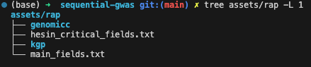
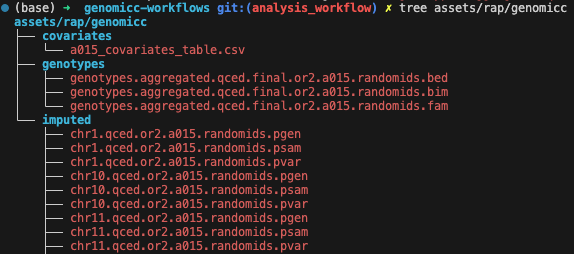

# Merging the GenOMICC and UK Biobank Cohorts

This workflow yields combined:

- genotypes in PLINK bed format: obtained by subsampling the TOPMed UKB imputed genotypes to keep the GenOMICC variants.
- imputed genotypes in PLINK pgen format: ontained by merging UKB and GenOMICC TOPMed UKB imputed genotypes.
- covariates containing the current age and sex of individuals
- ancestry estimates: via the 1000 Genome Project

It is assumed that you have installed the required dependencies as explained in [UKB RAP](@ref).

## 1. Uploading Inputs

This section describes the main inputs to the workflow that need to be uploaded to the RAP. I recommend deviating as little as possible from the following instructions to make sure things run smoothly afterwards. In this section we will populate the `assets/rap` folder in this repository that we will then upload to the RAP using the upload agent.

In particular we need to populate the `genomicc` and `kgp` subfolders as displayed below. The `hesin_critical_fields.txt` and `main_fields.txt` should already be present.



### GenOMICC Data

We will need the following GenOMICC data, at the present time, the name of the file does not matter since it seems impossible to reference a file by its path on the RAP, instead we will have to use file IDs: 

- genotypes: Output by [Combining GenOMICC Datasets](@ref).
- covariates (provided by Dominique): It should contain the following columns: `IID`,`FID`,`PRIM_DIAGNOSIS_ODAP`,`COHORT`,`ISARIC_MAX_SEVERITY_SCORE`,`SEX_SELF_REPORTED`,`AGE_YEARS_AT_RECRUITMENT`,`SUPERPOPULATION`
- imputed genotypes: Output by [GenOMICC Genotypes Imputation](@ref).

I recommend to organise them as follows:



!!! note "Imputed Genotypes"
    Keep the imputed genotypes organised in chromosomes. Only 3 chromosomes are presented above for readability but all 22 chromosomes should be in the folder.

### 1000 Genome Project

You will also need the 1000 Genome Project genotypes in plink format, filtered to keep only variants matching the GenOMICC genotyped variants. This is an output of the [Combining GenOMICC Datasets](@ref) workflow. They can be organised as follows:


### Other Assets

We also need the reference genome, which can be downloaded in the `assets/rap` folder with:

```bash
wget -O assets/rap/Homo_sapiens_assembly38.fasta https://storage.googleapis.com/genomics-public-data/resources/broad/hg38/v0/Homo_sapiens_assembly38.fasta
```

### Uploading the data

Since this is a lot of data, we need to use the [upload agent](https://documentation.dnanexus.com/downloads#installing-the-upload-agent). Asumming `ua` is in your path, run:

```bash
export AUTH_TOKEN=XXX
export PROJECT_ID=project-J0pkqyQJpYQ133JG1p2J1qzv
ua --project $PROJECT_ID --auth-token $AUTH_TOKEN --recursive --do-not-compress --folder /assets assets/rap/
```

## 2. Extracting Phenotypes

At this point, it seems impossible (or very difficult) to extract phenotypes from a WDL workflow because the source dataset is not a regular file (see [this](https://community.ukbiobank.ac.uk/hc/en-gb/community/posts/16019555833117-How-do-I-call-the-table-exporter-applet-from-my-WDL) or [that](https://community.ukbiobank.ac.uk/hc/en-gb/community/posts/16019577183901-I-would-like-to-access-phenotype-data-from-within-a-WDL-task-using-a-python-script-How-do-I-localize-the-database-file-as-an-input-to-the-task-I-m-getting-a-wrong-type-error)). We thus have to first run a native DNA Nexus workflow to extract some preliminary data from the source dataset. First we build the workflow:

```bash
dx build rap_workflows/export_covariates
```

Then run it (replace the `DATASET_RECORD_ID` with the one corresponding to your project):

```bash
DATASET_RECORD_ID=record-J0pqJxjJZF8G55f99FF11JJ9
dx run -y \
-istage-J0vx360JpYQ0Jg1QJ5Zv0PFx.dataset_or_cohort_or_dashboard=$DATASET_RECORD_ID \
-istage-J0vx360JpYQ0Jg1QJ5Zv0PFx.field_names_file_txt=/assets/hesin_critical_fields.txt \
-istage-J0ygjB0JpYQJg4b985gqYkx6.dataset_or_cohort_or_dashboard=$DATASET_RECORD_ID \
-istage-J0ygjB0JpYQJg4b985gqYkx6.field_names_file_txt=/assets/main_fields.txt \
/export_covariates
```

You can monitor the workflow on the RAP, once finished you should have two outputs in the `/export_covariates_outputs` folder.

## 3. Merging Cohorts

First you need to compile the WDL workflow and upload it to the RAP. However, a workflow is compiled for specific set of inputs which need to be provided first. All inputs are provided in the `rap_workflows/ukb_merge/inputs.json` file. Unfortunately all file paths are project specific and must be manually set using their `project-id:file-id` format which is quite tedious and error prone (file-ids can be found on the RAP). Then compiling the workflow can be done with the following:

```bash
export DX_COMPILER_PATH=/Users/olabayle/dxCompiler/dxCompiler-2.13.0.jar
java -jar $DX_COMPILER_PATH compile rap_workflows/ukb_merge/workflow.wdl -f -project $PROJECT_ID -folder /workflows/ukb_merge -inputs rap_workflows/ukb_merge/inputs.json
```

where the `DX_COMPILER_PATH` and `PROJECT_ID` have to be set appropriately. The compiler might output some warnings like `missing input for non-optional parameter` but you can ignore these.

!!! warning "Updating workflows"
    At this point in time it seems like compiling multiple times the same workflow does not replace the old files. You will need to manually erase them from the RAP.

Then, you can run the workflow with the following command

```bash
dx run -y \
-f rap_workflows/ukb_merge/inputs.dx.json \
--priority high \
--destination /ukb_merge_outputs/ \
/workflows/ukb_merge/merge_ukb_and_genomicc
```

All outputs will be located in the `ukb_merge_outputs` folder on the RAP.

- `genomicc_ukb.merged.imputed.chr_{1..22}.{pgen,psam,pva}`: Merged imputed genotypes.
- `ukb_genomicc.merged.{bed,bim,fam}`: Merged genotypes.
- `ukb_genomicc.covariates.csv`: Merged covariates